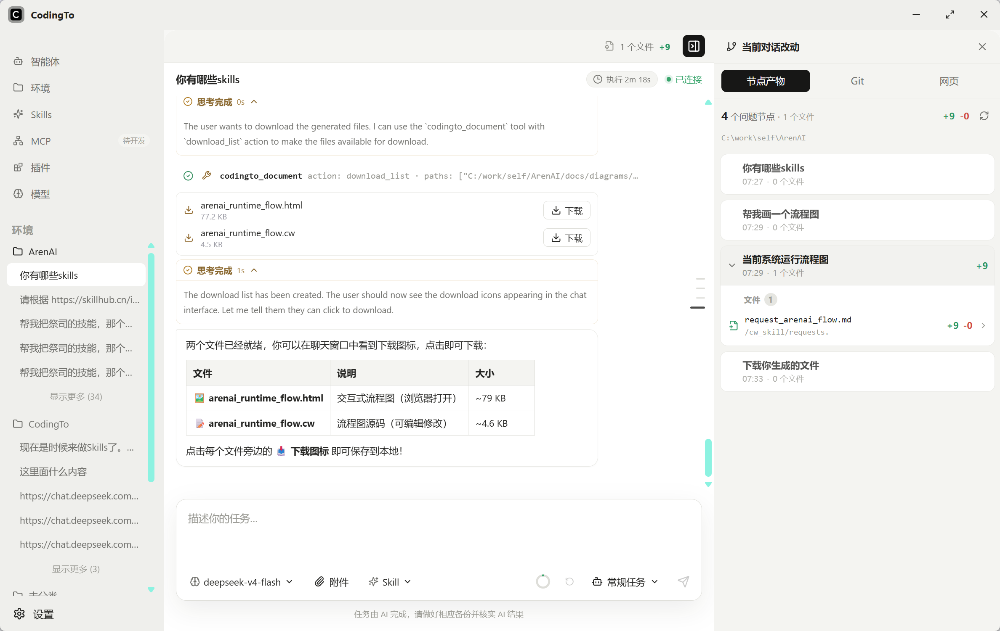
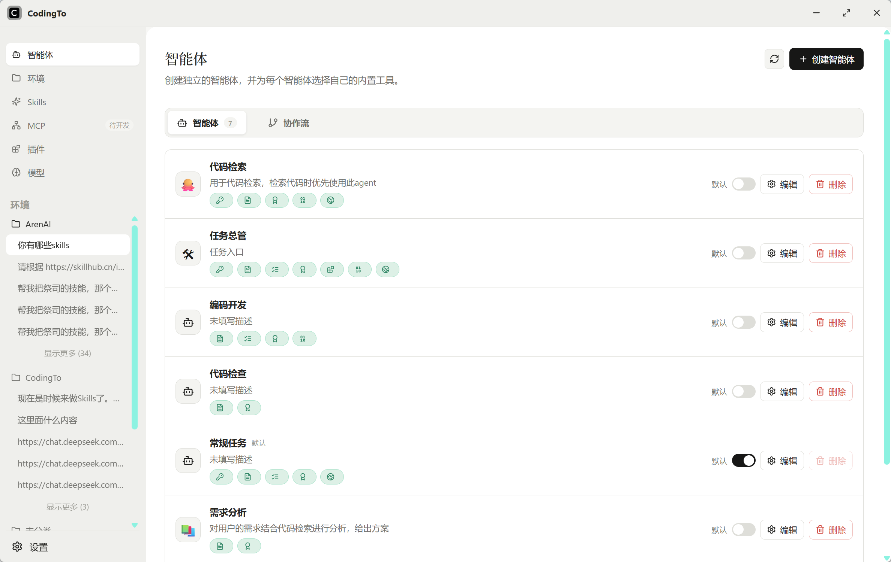
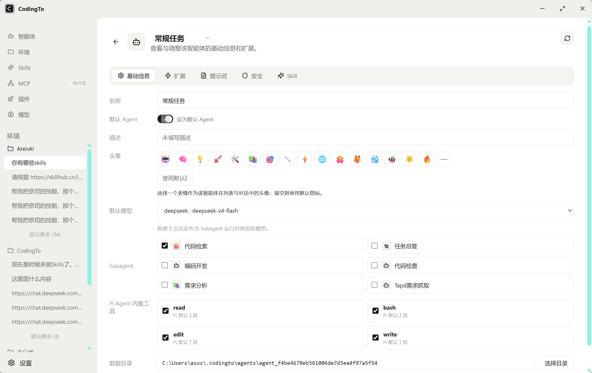
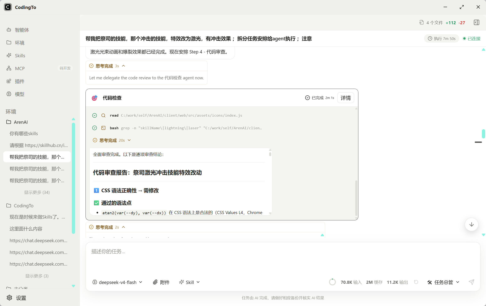
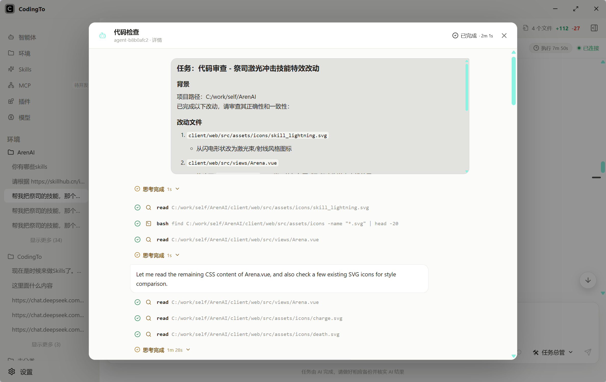
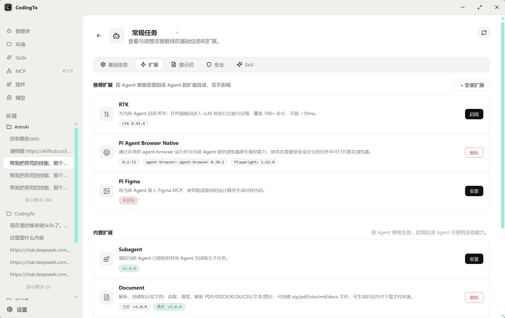
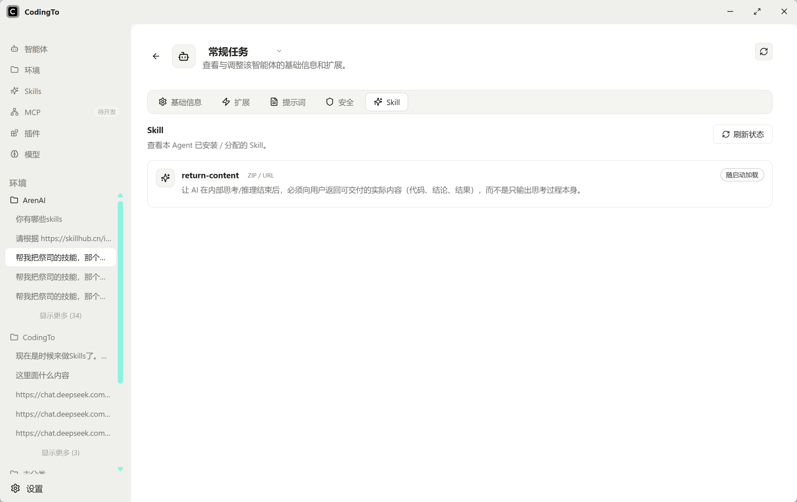
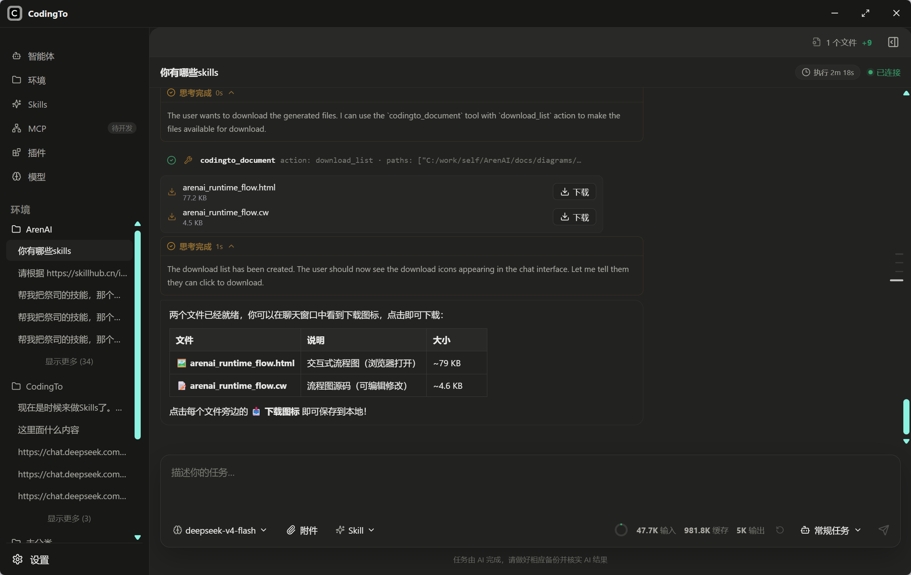

# CodingTo

> 一个本地优先、轻量流畅的多 Agent 桌面工作台。
>
> 多 Agent 隔离 · 使用简单 · 界面清爽 · 高度自定义 · 低内存占用

[](#)
[](https://www.apache.org/licenses/LICENSE-2.0)
[](https://wails.io)

CodingTo 基于 Pi Agent，将 AI 编程 Agent 封装为跨平台桌面应用。它希望在保留专业 Agent 能力和高度可定制性的同时，让日常使用保持简单、清晰和顺畅。

每个 Agent 都拥有独立的数据目录、模型配置、Skills、扩展和运行环境。会话与配置默认保存在本机，不绑定特定模型服务商，可按需接入云端模型、本地模型或兼容接口。



## 🎯 项目定位

### 多 Agent 隔离

不同 Agent 可以使用不同的模型、提示词、Skills、插件和工作目录。Agent 之间的配置与数据彼此隔离，适合为前端、后端、测试、文档或不同项目建立专属工作环境。

### 子 Agent 协作

主 Agent 可以按授权调用其他 Agent 处理独立子任务，例如代码审查、测试、资料检索或文档整理。子 Agent 只接收主 Agent 分派的任务描述，不继承父 Agent 的对话上下文、消息历史或临时状态。它使用自己的模型、数据目录、Skills、扩展和工具配置，在独立进程与会话目录中运行；执行过程可查看，回复与文件产出会回传并归入主任务。

### 使用简单

将复杂的 Agent 配置、会话管理和工具调用收拢到桌面界面中。完成模型和工作空间配置后，即可像普通聊天应用一样开始任务。

### 界面清爽

界面聚焦对话、执行过程和文件改动，减少无关信息干扰。工具调用、思考过程、子 Agent 和计划面板按需展开。

### 高度自定义

支持自定义模型服务商、模型参数、Agent 数据目录、Skills、插件、MCP、内置工具、主题和思考级别，让不同工作流拥有自己的配置组合。

### 轻量流畅

桌面端基于 Go、Wails 3 和 Vue 构建，按会话管理 Agent 进程和事件流，以较低的内存占用和流畅的长对话体验为设计目标。




## 📝 更新日志


#### 2026-07-28
- feat 增加支持skills，三种安装方式
- feat 右侧栏增加当前工作区改动以及改动对比

#### ...[查看更多](./update.md)

## ✨ 功能特性

### 🤖 多 Agent 与会话运行时

- **Agent 级数据隔离**：每个 Agent 使用独立的数据目录、模型注册表、Skills 和扩展配置。
- **并行会话运行时**：不同对话拥有各自的 Pi RPC 进程和事件流，互不干扰。
- **上下文管理**：支持手动与自动压缩上下文，并在对话历史中保留压缩记录。
- **内置工作流能力**：提供 Plan、文档处理、浏览器和子 Agent 等扩展能力。

### 🧠 子 Agent 协作

- **按 Agent 授权**：主 Agent 只能查看和调用已明确授权的子 Agent。
- **不继承父级上下文**：子 Agent 只接收本次分派的任务描述，不继承父 Agent 的对话上下文、消息历史或临时状态。
- **完整配置隔离**：子 Agent 使用自己的模型、提示词、数据目录、Skills、扩展和默认工具。
- **独立运行与记录**：每次子任务拥有独立进程、运行目录、事件日志和完整对话记录。
- **过程实时可见**：主对话中展示子 Agent 状态卡片，可进一步查看完整执行详情。
- **产出统一归档**：子 Agent 修改的文件和生成的产物会关联到主问题节点，在文件改动面板中统一查看。
- **防止递归调用**：当前子 Agent 不再继续创建下级 Agent，避免循环调用和失控扩散。




### 🔌 多服务商模型支持

- **协议驱动的配置**：内置 OpenAI、Anthropic、Google、DeepSeek、OpenRouter、xAI、Z.AI、Ollama、LM Studio 以及自定义兼容接口。
- **独立 `models.json`**：严格按 Pi Agent schema 生成，支持 provider/model 级别的 API、headers、OAuth、compat、cost 与 `thinkingLevelMap`。
- **丰富输入与推理能力**：支持图片输入、工具调用、推理模型，以及 `off` 到 `max` 五档思考级别。

### 🧩 自定义与扩展

- **Agent 独立配置**：为不同 Agent 设置默认模型、思考级别、数据目录和工具组合。
- **Skills 与插件**：按 Agent 安装和加载可复用能力，避免不同工作流相互污染。
- **MCP 与自定义工具**：连接外部服务，或为项目增加专属工具和交互界面。
- **兼容接口配置**：可调整 headers、OAuth、上下文窗口、费用、推理参数及供应商兼容选项。




### 🖥 桌面体验

- **清爽的三栏布局**：任务、对话和文件改动各自独立，信息层级清晰。
- **过程可追踪**：展示思考过程、工具调用、执行计划、子 Agent 状态和文件变更。
- **长任务不中断**：支持后台对话、待发送问题队列和多会话运行状态管理。
- **Wails 3 基础能力**：Service、Event Manager、Dialog Manager 与多窗口 API。
- **原生窗口体验**：Windows 无边框窗口、macOS hidden-inset 标题栏。

### 🎨 本地优先与个性化

- **三套主题**：跟随系统、浅色、深色。
- **本地数据**：配置、会话和 Agent 数据默认写入本机 `.codingto` 目录。



## 🚀 快速开始

1. 安装 Pi CLI：

   ```bash
   npm install -g --ignore-scripts @earendil-works/pi-coding-agent
   ```

2. 安装前端依赖：

   ```bash
   cd frontend
   npm install
   ```

3. 启动开发环境：

   ```bash
   go install github.com/wailsapp/wails/v3/cmd/wails3@v3.0.0-alpha2.117
   wails3 dev
   ```

## 🛠 开发环境

- Go 1.26+
- Node.js 20+
- Wails 3 `v3.0.0-alpha2.117`
- Windows 需要 WebView2；macOS 使用系统 WKWebView；Linux 需要 GTK3 与 WebKitGTK 4.1 开发库

> Wails 3 当前仍属预发布版本，项目已锁定 CLI、Go 模块与前端 Runtime 版本，升级时需三者同步更新并重新生成 bindings。

## 📦 构建

构建当前平台的生产包，产物位于 `bin/`：

```bash
wails3 task build
```

也可显式指定平台：`wails3 task windows:build`、`wails3 task darwin:build`、`wails3 task linux:build`。注意 macOS 与 Linux 桌面程序目前仅支持在对应系统上原生构建。

### GitHub 三平台发布

仓库内置 `.github/workflows/release.yml`，使用 GitHub 托管的原生 Windows、Linux 和 macOS runner 构建：

- Windows amd64：`.exe` 与 NSIS 安装包
- Linux amd64：`.tar.gz`
- macOS：amd64 + arm64 universal `.app.zip`

在 GitHub Actions 页面手动运行工作流只生成临时构建产物；推送形如 `v0.1.0` 的标签会在三个平台全部成功后自动创建或更新同名 GitHub Release。

发布标签必须与 `build/config.yml`、`internal/app/appupdate.go` 和 `frontend/package.json` 中的应用版本一致。当前工作流暂不包含 Windows 证书签名和 Apple Developer ID 签名、公证。

## 📂 数据目录

应用默认将本地数据写入用户主目录下的 `.codingto`：

- Windows：`%USERPROFILE%\.codingto`
- macOS / Linux：`~/.codingto`

## 📄 许可证

本项目基于 Apache License 2.0 开源，详见 [LICENSE](./LICENSE)。
